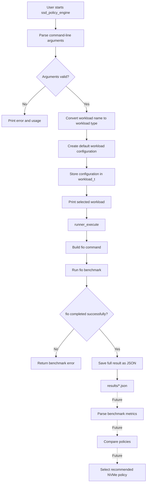
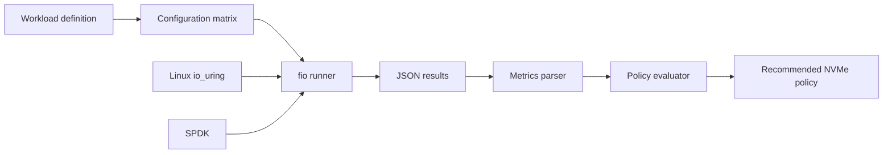

# Adaptive NVMe I/O Policy Engine

A small C project that runs predefined `fio` workloads, stores benchmark results in JSON format, and provides a foundation for an adaptive NVMe policy selection engine.

The current version implements the first complete execution path:

1. Read command-line arguments.
2. Select a predefined workload.
3. Convert the workload into an `fio` configuration.
4. Run the benchmark.
5. Save the result as JSON.

The next stages will add result parsing, workload comparison, queue-depth optimization, and automatic policy selection.

---

## Project status

### Implemented

- Command-line interface
- Workload selection
- Predefined random, sequential, and mixed workloads
- Workload configuration represented as C structures
- `fio` command generation
- Benchmark execution from C
- JSON result output
- CMake build configuration
- Basic input validation and error handling

### Planned

- Parse `fio` JSON results in C
- Extract IOPS, bandwidth, and latency percentiles
- Run the same workload with multiple queue depths
- Compare benchmark results
- Select the best policy for a defined objective
- Add NVMe device safety checks
- Add SPDK support
- Add automated tests

---

## Architecture



---

## Current execution flow

```text
Command-line arguments
        |
        v
main.c
        |
        +--> workload_type_from_string()
        |
        +--> workload_create_default()
        |
        +--> workload_print()
        |
        v
runner_execute()
        |
        +--> Build fio command
        |
        +--> Execute fio
        |
        v
JSON benchmark result
```

---

## Project structure

```text
adaptive-nvme-policy/
├── CMakeLists.txt
├── README.md
├── build/
├── include/
│   ├── workload.h
│   └── runner.h
├── results/
├── scripts/
├── src/
│   ├── main.c
│   ├── workload.c
│   └── runner.c
├── testdata/
└── tests/
```

### Directory responsibilities

| Path | Responsibility |
|---|---|
| `src/` | C source files |
| `include/` | Public module headers |
| `build/` | CMake-generated build files |
| `results/` | `fio` JSON benchmark results |
| `testdata/` | Safe test files used as benchmark targets |
| `scripts/` | Future automation and SPDK scripts |
| `tests/` | Future unit and integration tests |

---

## Modules

### `main.c`

The application entry point.

Responsibilities:

- Parse command-line options
- Handle `--help`
- Handle `--list-workloads`
- Validate required arguments
- Convert the workload name to an internal type
- Create the workload configuration
- Start the benchmark runner
- Return an appropriate process exit code

Supported command-line arguments:

```text
--workload <name>
--target <path>
--output <path>
--list-workloads
--help
-h
```

---

### `workload.c` and `workload.h`

The workload module defines benchmark profiles independently from the runner.

A workload is represented by `workload_t` and contains fields such as:

```c
type
name
fio_rw
block_size_bytes
queue_depth
jobs
read_percentage
runtime_seconds
random
```

This separation makes it possible to modify benchmark parameters without changing the runner logic.

---

### `runner.c` and `runner.h`

The runner converts `workload_t` into an `fio` command and executes it.

The main interface is:

```c
int runner_execute(
    const workload_t *workload,
    const char *target,
    const char *result_path
);
```

The runner:

1. Validates its input.
2. Builds the `fio` command.
3. Adds mixed-workload parameters when required.
4. Executes `fio`.
5. Checks the process exit status.
6. Saves the result in JSON format.

---

## Supported workloads

### Random read

```text
Name:              randread
Block size:        4 KiB
Read/write mode:   randread
Queue depth:       8
Jobs:              1
Read percentage:   100%
Runtime:           10 seconds
```

Use case:

- Random read IOPS
- Database-style read behavior
- Small-block NVMe read performance

---

### Random write

```text
Name:              randwrite
Block size:        4 KiB
Read/write mode:   randwrite
Queue depth:       8
Jobs:              1
Read percentage:   0%
Runtime:           10 seconds
```

Use case:

- Small-block write IOPS
- Write-intensive storage behavior

---

### Sequential read

```text
Name:              seqread
Block size:        128 KiB
Read/write mode:   read
Queue depth:       8
Jobs:              1
Read percentage:   100%
Runtime:           10 seconds
```

Use case:

- Large-file reading
- Streaming workloads
- Maximum read bandwidth

---

### Sequential write

```text
Name:              seqwrite
Block size:        128 KiB
Read/write mode:   write
Queue depth:       8
Jobs:              1
Read percentage:   0%
Runtime:           10 seconds
```

Use case:

- Large-file writing
- Sequential write bandwidth

---

### Mixed random workload

```text
Name:              mixed
Block size:        4 KiB
Read/write mode:   randrw
Queue depth:       16
Jobs:              1
Read percentage:   70%
Write percentage:  30%
Runtime:           10 seconds
```

Use case:

- Application-like mixed I/O
- Database and service workloads
- Read-dominant random access

---

## Build

### Requirements

- Linux
- C compiler with C11 support
- CMake
- `fio`
- Optional: `jq`

Example installation on Ubuntu:

```bash
sudo apt update
sudo apt install -y build-essential cmake fio jq
```

### Configure and compile

```bash
cmake -S . -B build
cmake --build build
```

The resulting executable is:

```text
build/ssd_policy_engine
```

---

## Usage

### Display help

```bash
./build/ssd_policy_engine --help
```

### List workloads

```bash
./build/ssd_policy_engine --list-workloads
```

### Run a random-read benchmark

```bash
./build/ssd_policy_engine \
  --workload randread \
  --target ./testdata/benchmark.bin \
  --output ./results/randread.json
```

### Run a mixed benchmark

```bash
./build/ssd_policy_engine \
  --workload mixed \
  --target ./testdata/benchmark.bin \
  --output ./results/mixed.json
```

If `--output` is omitted, the default path is:

```text
results/fio_result.json
```

---

## Generated `fio` command

For a random-read workload, the runner builds a command similar to:

```bash
fio \
  --name="randread" \
  --filename="./testdata/benchmark.bin" \
  --rw=randread \
  --bs=4096 \
  --iodepth=8 \
  --numjobs=1 \
  --ioengine=io_uring \
  --direct=1 \
  --time_based=1 \
  --runtime=10 \
  --ramp_time=2 \
  --size=1G \
  --group_reporting=1 \
  --output-format=json \
  --output="./results/randread.json"
```

For the mixed workload, the following parameter is also added:

```bash
--rwmixread=70
```

---

## Important `fio` parameters

| Parameter | Meaning |
|---|---|
| `--rw` | Workload access mode |
| `--bs` | Block size |
| `--iodepth` | Maximum number of outstanding I/O operations |
| `--numjobs` | Number of parallel jobs |
| `--ioengine=io_uring` | Linux asynchronous I/O engine |
| `--direct=1` | Reduces the influence of the operating-system page cache |
| `--time_based=1` | Runs the workload for a fixed duration |
| `--runtime` | Measurement duration |
| `--ramp_time=2` | Warm-up period before measurement |
| `--size=1G` | Size of the tested area |
| `--group_reporting=1` | Produces aggregated results |
| `--output-format=json` | Generates machine-readable results |

---

## Reading benchmark results

A result can be inspected with:

```bash
jq '.' results/randread.json
```

Selected metrics:

```bash
jq '.jobs[0] | {
  read_iops: .read.iops,
  read_bandwidth_kib: .read.bw,
  latency_mean_ns: .read.clat_ns.mean,
  latency_p99_ns: .read.clat_ns.percentile["99.000000"]
}' results/randread.json
```

Future versions of the project will extract these values directly in C.

---

## Safety

The recommended development target is a regular test file:

```text
./testdata/benchmark.bin
```

Do not run write workloads directly on an NVMe block device containing valuable data.

Examples of dangerous targets include:

```text
/dev/nvme0n1
/dev/nvme1n1
```

Random-write, sequential-write, and mixed workloads can overwrite data.

Raw NVMe testing should only be introduced after:

- device detection,
- explicit user confirmation,
- mounted-device checks,
- partition checks,
- clear destructive-operation warnings.

---

## Roadmap

### Milestone 1 — Benchmark runner

Current milestone.

```text
CLI -> workload configuration -> fio execution -> JSON result
```

### Milestone 2 — Result parser

Planned output structure:

```c
typedef struct {
    double read_iops;
    double write_iops;
    double read_bandwidth_kib;
    double write_bandwidth_kib;
    double mean_latency_ns;
    double p99_latency_ns;
} benchmark_result_t;
```

### Milestone 3 — Experiment matrix

Run the same workload with multiple configurations:

```text
Queue depth: 1, 4, 8, 16, 32, 64
Jobs:       1, 2, 4
```

### Milestone 4 — Policy evaluation

Example objectives:

- Maximum IOPS
- Maximum bandwidth
- Minimum average latency
- Minimum p99 latency
- Best performance under a latency limit

### Milestone 5 — Adaptive policy engine

The program will compare results and return a recommendation such as:

```text
Recommended policy:
  Queue depth: 16
  Jobs: 2
  Expected IOPS: 642,000
  Expected p99 latency: 1.8 ms
```

### Milestone 6 — NVMe and SPDK

- Detect NVMe devices
- Add safe raw-device testing
- Add SPDK `fio` engine support
- Compare kernel `io_uring` and SPDK performance
- Document CPU affinity and hugepage requirements

---

## Final project vision



The final application will not only run benchmarks. It will automatically determine which I/O configuration best matches the selected workload and optimization objective.
